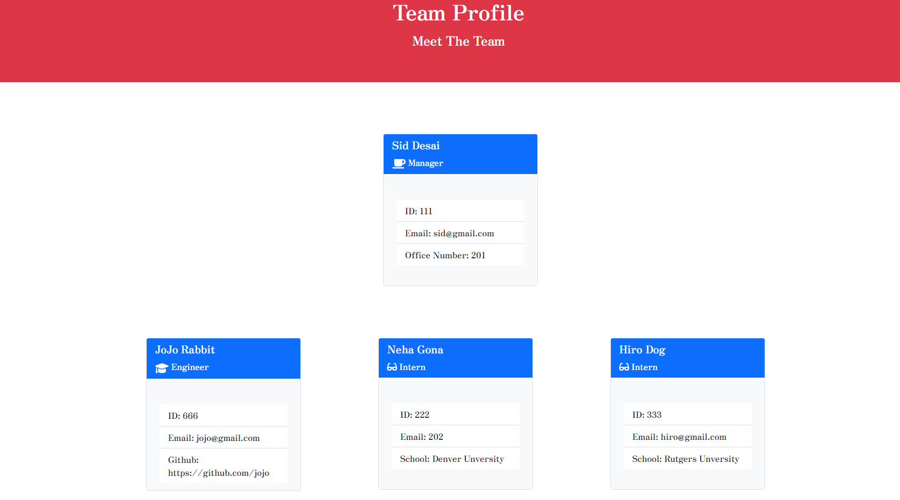
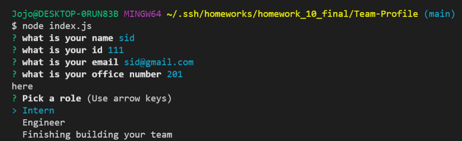

# Team Profile
### Siddharth Desai
## Description
The purpose of this project was to build a command-line base application to generate a team profile html page. The user will be prompted with a series of questions through the command line using Inquirer and their answers are later used to generate the HTML page. The profiles are broken down into three role types: manager, intern and engineer. The user is only allowed one manager however has the ability to add as many interns and engineers as desired. Once the user is done adding interns and engineer profiles they can select “Finish building my team” in the command line options and this will generate the final HTML team profile page.
<br/>

[](https://opensource.org/licenses/BSD-2-Clause)
## Table of Contents
1. [ Description. ](#description)
2. [ Installation. ](#installation)
3. [ Usage. ](#usage)
4. [ License. ](#license)
6. [ Tests. ](#tests)
7. [ Questions. ](#questions)
7. [ Resources. ](#resources)
## Installation
* Clone the repository using:
```
git@github.com:SHD118/Team-Profile.git
```
* Ensure you are in the current working directory
* Ensure all dependencies are installed (jest and inquirer) installation instructions are below:
```
npm install jest
```
```
npm install inqurier
```

Run the the best team profile generator by typing the following in the terminal:
```
node index.js
```
## Usage
* Naviagte to the project directory in a integrated terminal
* Run the index.js (node index.js)
* Answer all the prompted questions in the terminal 
* Once "Finished building the Team" and index.html page will generate.
* To View right click the index.html file and open it in a broswer of your choice
* You have successfully generated and are now able to view your team profile
## License
Free Use
## Tests
* Ensure jest is installed (npm install jest)
* In the command line, write:
```
npm run test
```
* Confirm all four test suites pass (see screenshot below). Test suites are located in the test folder and are titled: Employee.test.js, Engineer.test.js, Intern.test.js, and Manager.test.js
## Questions?
Want to see more of my work? [Github Link](https://github.com/SHD118/Team-Profile)
<br/>
Want to learn more please contact me at shdesai118@gmail.com

## Video
https://drive.google.com/file/d/1OEZiRV_OT2mhPgnwRQ3iIsYqFI-36Nm7/view?usp=sharing

## Screenshots





## Links
* https://shd118.github.io/Team-Profile/
* https://github.com/SHD118/Team-Profile

## Resources
* https://gist.github.com/lukas-h/2a5d00690736b4c3a7ba
* https://fontawesome.com/v6.0/icons?q=gra&m=free
* https://www.npmjs.com/package/inquirer

