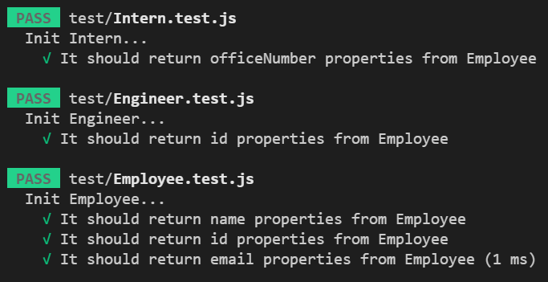

# Team Profile
### Siddharth Desai
## Description
The purpose of this project was to build a command-line base application to generate a team profile html page. The user will be prompted with a series of questions through the command line using Inquirer and their answers are later used to generate the HTML page. The profiles are broken down into three role types: manager, intern and engineer. The user is only allowed one manager however has the ability to add as many interns and engineers as desired. Once the user is done adding interns and engineer profiles they can select “Finish building my team” in the command line options and this will generate the final HTML team profile page.
<br/>

[](https://opensource.org/licenses/BSD-2-Clause)
## Table of Contents
1. [ Description. ](#description)
2. [ Installation. ](#installation)
3. [ Usage. ](#usage)
4. [ License. ](#license)
6. [ Tests. ](#tests)
7. [ Questions. ](#questions)
7. [ Resources. ](#resources)
## Installation
* Clone the repository using:
```
git@github.com:SHD118/Team-Profile.git
```
* Ensure you are in the current working directory
* Install dependencies (jest and inquirer) by opening the terminal (ctrl + j on windows) and running:
```
npm install
```
* Run the project by typing the following in the terminal:
```
node index.js
```
## Usage
N/A
## License
Free Use
## Tests
* Ensure you have installed jest (this was installed earlier when 'npm install' was run in the command line)
* In the command line, write:
```
npm run test
```
* Confirm all four test files pass (see screenshot below). Test files are located in the tests folder and are titled: Employee.test.js, Engineer.test.js, Intern.test.js, and Manager.test.js
## Questions?
Want to see more of my work? [Github Link](https://github.com/SHD118/Team-Profile)
<br/>
## Video

## Screenshots


Want to learn more please contact me at shdesai118@gmail.com
## Resources
* https://gist.github.com/lukas-h/2a5d00690736b4c3a7ba
* https://fontawesome.com/v6.0/icons?q=gra&m=free
* https://www.npmjs.com/package/inquirer

